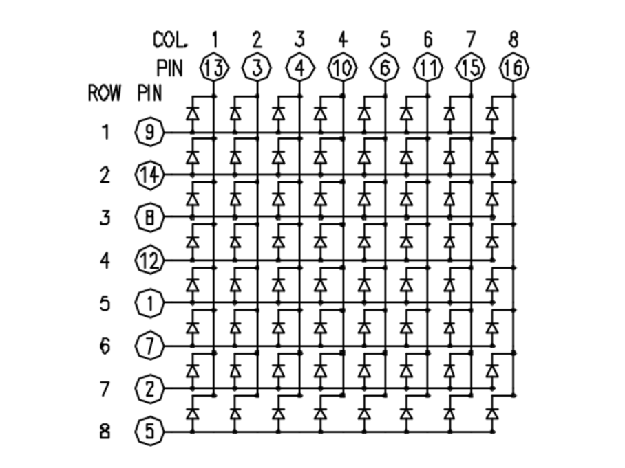
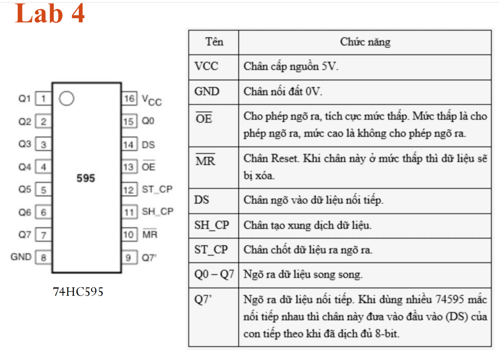
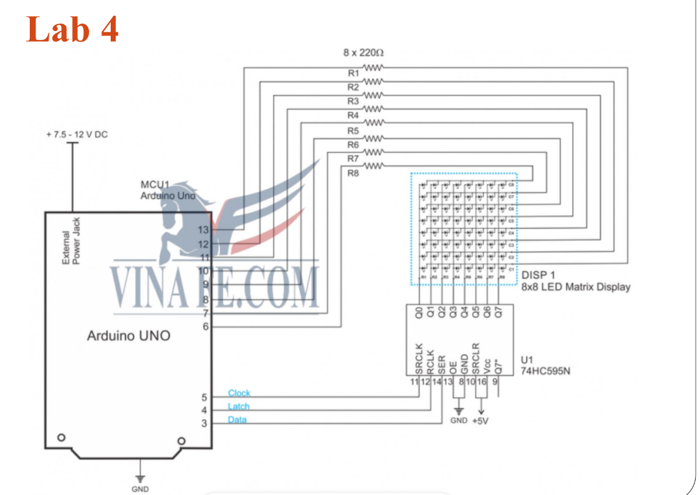

# Lab 4

## Mục tiêu
Hiểu nguyên lý và thực hành hiển thị lên LED ma trận dùng Arduino và IC dịch 74HC595.

## Linh kiện cần thiết
- Mạch Arduino Uno R3

- Mạch khung (Breadboard)

- Dây nối

- Led ma trận 8x8

- IC 74HC595

## Yêu cầu
- Hiển thị thông tin yêu cầu lên led ma trận:

    - Yêu cầu 1: Hiển thị chữ cái đầu tiên trong tên của sinh viên lên led ma trận.

    - Yêu cầu 2: Hiển thị lần lượt các chữ cái trong tên của sinh viên lên led ma trận.

    - Yêu cầu 3: Hiển thị tên sinh viên trên led ma trận bằng cách dịch lần lượt các chữ cái từ trái sang phải.

